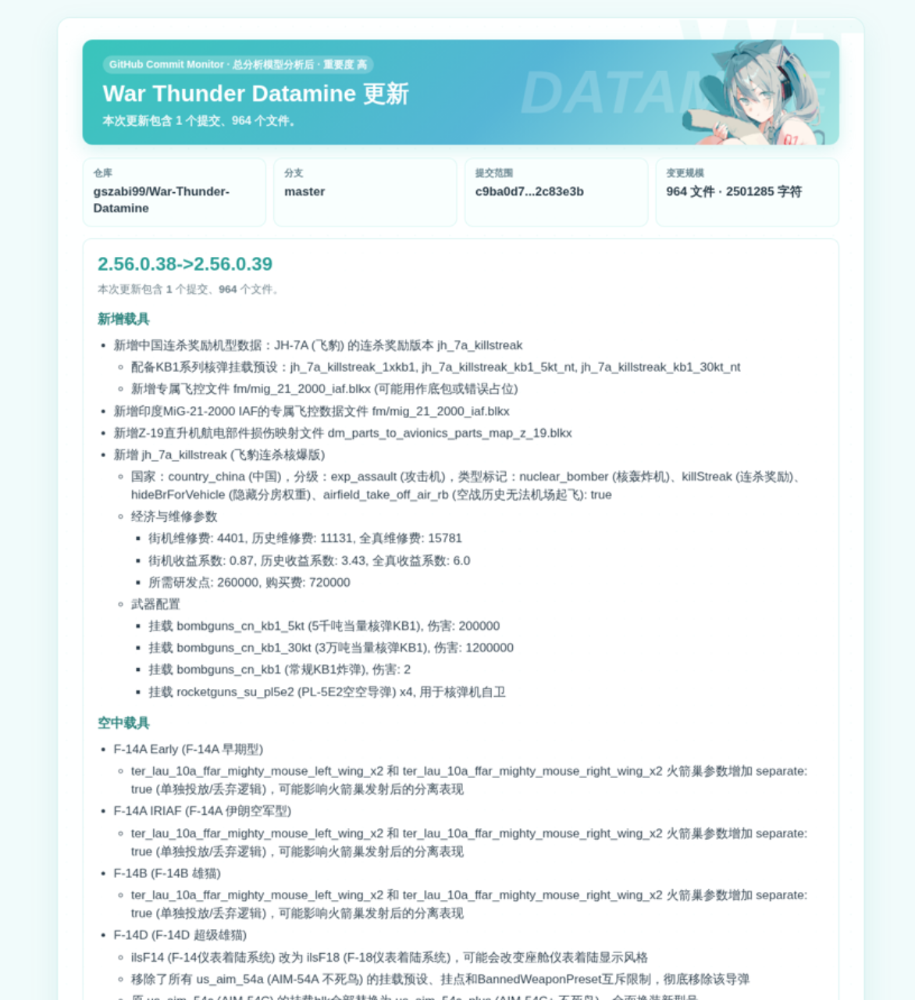
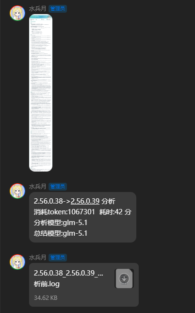
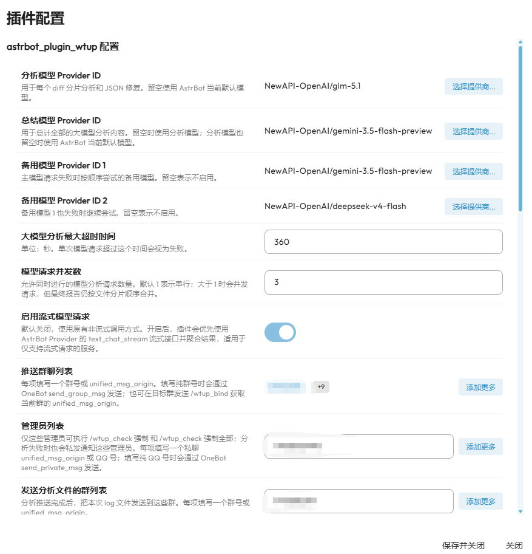
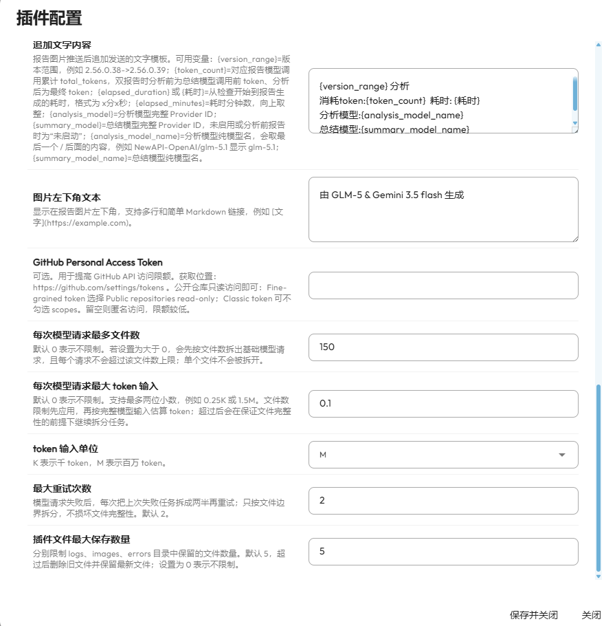
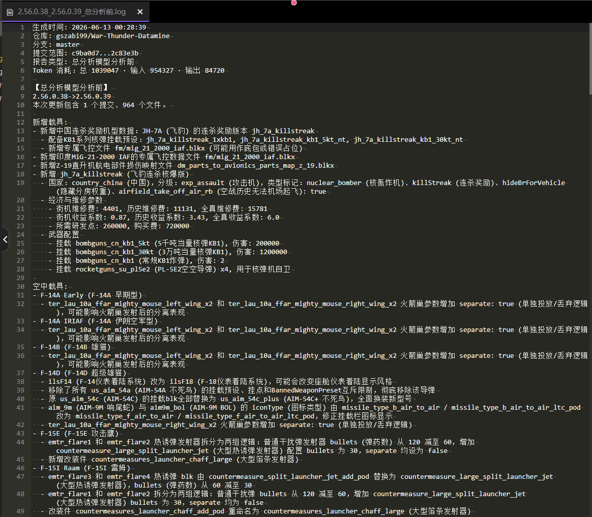

# astrbot_plugin_wtup

AstrBot 的 War Thunder Datamine 更新监控插件。

## 插件展示

<p align="center">
  
  
</p>

<p align="center">
  
  
  
</p>

插件固定监控：

```text
https://github.com/gszabi99/War-Thunder-Datamine
branch: master
mode: commit
```

感谢仓库 [gszabi99/War-Thunder-Datamine](https://github.com/gszabi99/War-Thunder-Datamine) 开源贡献的内容。

发现新 commit 后，插件会获取 GitHub compare 数据，把 commit、文件列表和 patch 交给 AstrBot 已配置的大模型分析，然后使用 `templates/help_miku.html` 渲染图片并主动推送到配置的群聊列表。

报告图片底部会居中显示本次模型 token 消耗，格式为 `Token 消耗：总 X · 输入 Y · 输出 Z`。`总`、`输入`、`输出` 分别对应模型接口返回的 `total_tokens`、`prompt_tokens`、`completion_tokens` 累计值；如果 Provider 不返回 usage，则显示为 0。

## 项目结构

主要代码按职责拆分：

- `main.py`：AstrBot 插件入口，负责生命周期、命令注册和调用检查服务。
- `wtup/service.py`：一次更新检查的主流程编排，包括拉取 GitHub 数据、生成报告、推送结果。
- `wtup/runtime.py`：运行时状态、错误日志、报告日志和推送附加文字格式化。
- `wtup/token_usage.py`：token usage 数字读取和展示文案格式化。
- `wtup/analysis/`：模型分析相关模块，包含提示词、模型请求、JSON 修复、失败重试、结果合并和结构标准化。
- `wtup/analyzer.py`：兼容导出层，保留旧的 `wtup.analyzer` 导入路径。
- `wtup/diff_collector.py`：GitHub compare/diff 数据整理和文件分片。
- `wtup/renderer.py`：报告 HTML、纯文本和图片渲染辅助。
- `wtup/notifier.py`：群消息、文字消息和日志文件推送。
- `templates/help_miku.html`：报告 HTML 骨架。
- `templates/help_miku.css`：报告样式文件，由 `renderer.py` 读取后注入 HTML。

## 配置

后台配置项：

- `provider_id`：分析模型 Provider ID，留空使用默认模型。
- `summary_provider_id`：总结模型 Provider ID，留空使用分析模型；分析模型也留空时使用默认模型。
- `backup_provider_id_1`：备用模型 Provider ID 1，主模型请求失败时优先尝试。
- `backup_provider_id_2`：备用模型 Provider ID 2，备用模型 1 也失败时继续尝试。
- `timeout_seconds`：单次模型请求的大模型分析超时时间，单位秒。
- `model_concurrency`：模型请求并发数，默认 1 表示串行。
- `enable_streaming_llm_call`：是否启用流式模型请求，默认关闭。开启后优先使用 AstrBot Provider 的 `text_chat_stream` 流式接口并聚合结果。
- `target_groups`：推送群聊列表，每项一个群号或 `unified_msg_origin`。填写纯群号时会通过 OneBot `send_group_msg` 发送。
- `admin_targets`：管理员列表。仅这些管理员可执行 `/wtup_check 强制` 和 `/wtup_check 强制全部`；分析失败时也会私发通知这些管理员。每项填写一个私聊 `unified_msg_origin` 或 QQ 号；填写纯 QQ 号时会通过 OneBot `send_private_msg` 发送。
- `analysis_file_groups`：发送分析文件的群列表，分析推送完成后会把本次 `.log` 文件发送到这些群。
- `monitor_interval_minutes`：监控频率，默认 30 分钟。
- `analysis_prompt`：分析提示词。
- `summary_prompt`：总结提示词，用于总结模型整理全部分片分析结果。
- `enable_summary_model`：是否启动总结模型，默认关闭。兼容旧配置项 `enable_second_pass_analysis`。
- `enable_pre_summary_report`：是否生成分析前报告，默认关闭。开启后且总结模型也开启时，会生成总分析模型分析前和分析后的两份报告。
- `enable_push_append_text`：推送时是否启动追加文字内容推送，默认关闭。启用双报告时，每份报告图片后都会追加一条对应文字。
- `push_append_text_template`：追加文字内容模板，支持 `{version_range}`、`{token_count}`、`{elapsed_duration}`、`{耗时}`、`{elapsed_minutes}`、`{analysis_model}`、`{summary_model}`、`{analysis_model_name}`、`{summary_model_name}`。其中 `{token_count}` 为模型接口返回的真实总 token 消耗，`{elapsed_duration}` 和 `{耗时}` 会输出 `x分x秒`，`*_model_name` 会取 Provider ID 最后一个 `/` 后面的纯模型名。
- `footer_note`：报告图片左下角文本，支持多行和简单 Markdown 链接，默认显示 `gszabi99/War-Thunder-Datamine` 仓库链接。
- `github_token`：GitHub Personal Access Token，可选。
- `max_files_per_report`：每次模型请求最多文件数，默认 0 表示不限制。
- `max_input_tokens`：每次模型请求最大 token 输入，默认 0 表示不限制，支持最多两位小数。
- `max_input_token_unit`：token 输入单位，可选 `K` 或 `M`。
- `max_retry_count`：最大重试次数，默认 2。每次重试都会把失败任务按文件边界拆成两半。
- `max_saved_artifacts`：插件文件最大保存数量，默认 5。分别限制 `logs/`、`images/`、`errors/` 目录保留最新 5 个文件；设置为 0 表示不限制。

`github_token` 获取位置：

```text
https://github.com/settings/tokens
```

公开仓库只需要只读能力。Fine-grained token 选择 Public repositories read-only；Classic token 可不勾选 scopes。留空也能使用匿名请求，但 GitHub API 限额较低。

## 命令

```text
/wtup_status
```

查看监控状态、最近 commit、检查间隔和限制配置。

```text
/wtup_bind
```

获取当前群聊的 `unified_msg_origin`。推送群聊列表也可以直接填写群号。

```text
/wtup_check
```

手动检查一次。首次运行只建立基线，不推送历史更新。

```text
/wtup_check 强制
```

强制分析最新一个 commit，用于测试图片渲染和模型分析。命令会直接发送到当前触发命令的群，不使用后台配置的 `target_groups` 和 `analysis_file_groups` 列表；如果无法识别当前群号，会提示失败。开启 `enable_pre_summary_report` 且总结模型启用时，当前群会依次收到分析前和分析后的两份报告，并上传两份 `.log` 分析日志；开启 `enable_push_append_text` 时，每份报告图片后都会追加对应文字内容。

仅插件后台 `admin_targets` 管理员列表中的用户可执行。

```text
/wtup_check 强制全部
```

强制分析最新一个 commit，并推送到后台配置的全部 `target_groups`；如果配置了 `analysis_file_groups`，也会向这些群上传分析日志。仅插件后台 `admin_targets` 管理员列表中的用户可执行。

## 模型请求拆分规则

`max_files_per_report` 和 `max_input_tokens` 默认都是 `0`，表示不限制。

如果其中任意一个设置为大于 `0`，插件会先按 `max_files_per_report` 把文件拆成基础分片，设置为大于 `0` 时每个基础分片都不会超过该文件数上限。随后插件再按完整模型输入估算 token；某一次请求超过 `max_input_tokens` 时，会在保证文件完整性的前提下继续拆分该基础分片。拆分前仍会优先把同目录、同后缀且文件名相近的改动排在一起。每次请求都会单独调用一次分析模型，所有分析结果会按分片顺序合并成报告；默认最终只生成一张图片并推送一次。

插件只在文件边界拆分，不会拆开单个文件 patch。设置 `max_files_per_report` 后，实际模型请求不会超过该文件数上限；由于要保证文件完整性，token 估算值可能会超过配置值。如果某个文件本身超过 `max_input_tokens`，它会完整进入某个分片，不会被截断。

`max_input_token_unit` 控制 `max_input_tokens` 的单位：`K` 表示千 token，`M` 表示百万 token。`max_input_tokens` 支持最多两位小数，例如 `0.25K` 表示 250 token，`1.5M` 表示 1,500,000 token。

`model_concurrency` 控制同时进行的模型请求数量。默认 `1` 表示串行；设置为大于 `1` 时会并发分析多个分片，但不会按完成先后合并，最终仍按分片顺序整理报告。

`enable_streaming_llm_call` 默认关闭，关闭时继续使用原有 `context.llm_generate` 非流式调用。开启后，插件会优先通过 AstrBot Provider 的 `text_chat_stream` 流式接口请求模型，并把流式片段聚合成完整响应再进入 JSON 解析、修复、重试和 token 统计流程。该开关适用于仅支持流式请求的服务；如果未配置 Provider ID 且无法定位可用流式 Provider，插件会记录 warning 并回退为非流式请求。

如果配置了 `backup_provider_id_1` 或 `backup_provider_id_2`，分片分析会先使用主模型；主模型请求报错、超时或返回空内容后，会先按 `max_retry_count` 对当前失败分片执行拆分重试。当前模型达到最大重试次数或分片已不可继续拆分后仍失败，才会按备用模型 1、备用模型 2 的顺序重新分析原始失败分片。备用模型会执行同样的拆分重试规则；如果某个备用模型配置为空或不可用，会自动跳过。

`max_retry_count` 控制每个模型最多拆分重试几轮，默认 2；每一轮都会把上一次失败分片的文件数量减半后重试，只按文件边界拆分，不会拆开单个文件 patch，并遵守 `model_concurrency` 限制。如果分片只有 1 个文件或达到最大重试次数，当前模型才会停止拆分；还有备用模型时会继续切换备用模型，没有备用模型时才会生成需复核的兜底分析。JSON 修复和总结模型请求没有可拆分的文件分片，仍按主模型、备用模型 1、备用模型 2 的顺序重试同一份输入。

如果本次分析最终失败或进入需复核兜底报告，插件不会向 `target_groups` 发送报告、追加文字或向 `analysis_file_groups` 上传日志，改为私发通知 `admin_targets`。未配置管理员列表时只记录日志。该情况下不会把本次 commit 标记为完成，下次循环会继续重试。

如果模型返回内容不是有效 JSON，插件会强制再发起一次模型请求，要求模型基于原始输出修复为严格 JSON。这个 JSON 修复请求不受“是否启动总结模型”开关影响；如果修复仍失败，才会生成需复核的兜底分析。

`enable_summary_model` 默认关闭。关闭时，插件使用程序内置规则把多次模型分析结果直接合并为最终报告。

开启后，如果本次 diff 被拆成多次模型请求，插件会先按程序规则初步合并各分片结果，再额外请求一次总结模型整理最终报告。总结模型只基于已有分片分析结果，不重新读取原始 diff；它会尽量去重、合并相近条目并整理最终报告。该功能会增加一次模型调用和等待时间；如果总结模型失败或输出不是有效 JSON，插件会自动回退到程序初步合并结果继续推送。

`enable_pre_summary_report` 默认关闭。开启后且 `enable_summary_model` 也开启时，插件会保留总结模型处理前的程序合并报告，并在总结模型处理后再生成最终报告。两份报告都会渲染图片、保存日志；`/wtup_check 强制` 会依次把两份报告和两份日志文件发送到当前群；如果配置了群推送，会依次发送两张报告图；如果配置了 `analysis_file_groups`，也会上传两份 `.log` 文件。两份报告的图片和文本里会标注“总分析模型分析前 / 总分析模型分析后”，日志文件名会追加 `_总分析前` 和 `_总分析后`，避免同一版本范围互相覆盖。

如果开启了总结模型，但程序初步合并分片结果时发生异常，插件不会直接中断。本次检查会把各分片的分析 JSON、分片错误信息和原始模型输出文本交给总结模型生成最终报告；如果这一步仍然失败，才会生成需复核的兜底报告。

总结模型、JSON 修复和失败拆分重试是三套独立机制：总结模型只负责最终整理；JSON 修复只负责把非 JSON 输出修复为严格 JSON；失败拆分重试只处理模型请求失败。

插件会统计本次检查内所有模型调用返回的 token usage，包括分片分析、失败后拆分重试、JSON 修复请求和总结模型请求。统计口径优先使用 AstrBot Provider 返回的 `usage.input`、`usage.output`、`usage.total`，同时兼容 OpenAI 风格的 `prompt_tokens`、`completion_tokens`、`total_tokens`；如果当前 Provider 不返回 usage，则对应请求记为 0，不再用输入估算值冒充真实消耗。

启用 `enable_pre_summary_report` 的双报告模式下，分析前报告显示和保存的是总结模型调用前的累计 token；分析后报告显示和保存的是包含总结模型在内的最终累计 token。

## 推送附加内容

开启 `enable_push_append_text` 后，报告图片推送完成后会追加一条文字消息；使用 `/wtup_check 强制` 时，这条文字会发送到当前群。默认模板示例：

```text
{version_range} 分析完成
消耗token:{token_count}
耗时{elapsed_duration}
分析模型:{analysis_model}
总结模型:{summary_model}
```

`{token_count}` 表示对应报告实际模型调用返回的 `total_tokens` 累计值，包含分析模型、总结模型、JSON 修复和拆分重试产生的额外请求。`{elapsed_duration}` 和 `{耗时}` 表示从检查开始到报告生成的耗时，直接输出 `x分x秒`；`{elapsed_minutes}` 仍可用于兼容旧模板，表示向上取整后的分钟数。启用双报告时，分析前追加文字使用总结模型调用前的累计 token，且总结模型显示为 `未启动`；分析后追加文字使用包含总结模型在内的最终累计 token。`{analysis_model}` 和 `{summary_model}` 输出完整 Provider ID；`{analysis_model_name}` 和 `{summary_model_name}` 输出纯模型名，例如 `NewAPI-OpenAI/glm-5.1` 会显示为 `glm-5.1`。最近一次任务状态也会保存 `token_usage.prompt_tokens`、`token_usage.completion_tokens` 和 `token_usage.total_tokens` 明细。

配置 `analysis_file_groups` 后，群推送流程完成会把本次 `.log` 文件发送到这些群。纯群号会优先通过 OneBot `upload_group_file` 上传；如果平台或目标不支持文件发送，会直接跳过，不再兜底发送日志文本。开启 `enable_pre_summary_report` 且总结模型启用时，会发送分析前和分析后的两份日志文件。

每次检查还会额外生成一份任务流水日志，保存本次任务从开始、GitHub 获取、diff 摘要、模型分析、报告生成到推送结束的全流程记录。每一次模型请求都会记录“第几次模型请求”、Provider、分片信息、估算输入 token 数量、请求耗时和 Provider 返回的真实 token usage，不记录模型输入正文，方便按单次任务回溯问题。

## 数据持久化

插件会在 AstrBot 插件数据目录中保存运行数据：

- `state.json`：保存最近检查 commit、最近一次生成任务 `last_generated_task`，以及最近一次群推送任务 `last_pushed_task`。启用双报告时，任务状态的 `reports` 会记录每份报告的日志和图片路径，旧的 `log_path`、`image_path` 字段仍指向最终报告；`task_log_path` 会指向本次任务流水日志。
- `logs/`：保存每次最终文本报告，不再记录图片文件路径和 GitHub compare Source 链接。日志头部会保存本次 token 消耗，格式为 `Token 消耗：总 X · 输入 Y · 输出 Z`。若报告标题是 `版本->版本` 格式，文件名会保存为 `旧版本_新版本.log`，例如 `2.56.0.38_2.56.0.39.log`；否则使用本地时间命名，例如 `2026年6月12日03：00：18.log`。启用双报告时，会保存为 `旧版本_新版本_总分析前.log` 和 `旧版本_新版本_总分析后.log`。
- `task_logs/`：保存每次检查的全流程任务日志，文件名精确到秒，例如 `2026年6月12日09时49分02秒_任务.log`。任务日志包含开始/结束、每个阶段、报告生成、推送结果，以及每次模型请求的输入 token 数量估算。
- `errors/`：保存单个 Provider 请求失败、拆分重试、JSON 修复和总结模型相关错误日志，文件名精确到秒，例如 `2026年6月12日09时49分02秒.log`。错误日志包含 stage、错误类型、错误文本、traceback、Provider ID 和本次 compare/chunk 元数据；即使后续备用模型成功，主模型的失败原因也会单独记录。
- `images/`：保存渲染后的报告图片。

`max_saved_artifacts` 默认会让 `logs/`、`task_logs/`、`errors/`、`images/` 分别保留最新 5 个文件，超出数量会删除旧文件。

## 首次运行

定时任务首次启动时会把当前最新 commit 记录为基线，不推送历史更新，避免刷屏。之后只有检测到新的 commit 才会分析和推送。

定时检查发现更新后，只有报告至少成功发送到一个推送目标，才会把本次最新 commit 标记为已完成。若模型分析、渲染或报告推送失败导致报告没有发出，`last_commit_sha` 会保留在上一次已完成的 commit，下一次循环会继续分析并重试同一段更新。日志文件发送和追加文字发送不单独视为报告送达。
